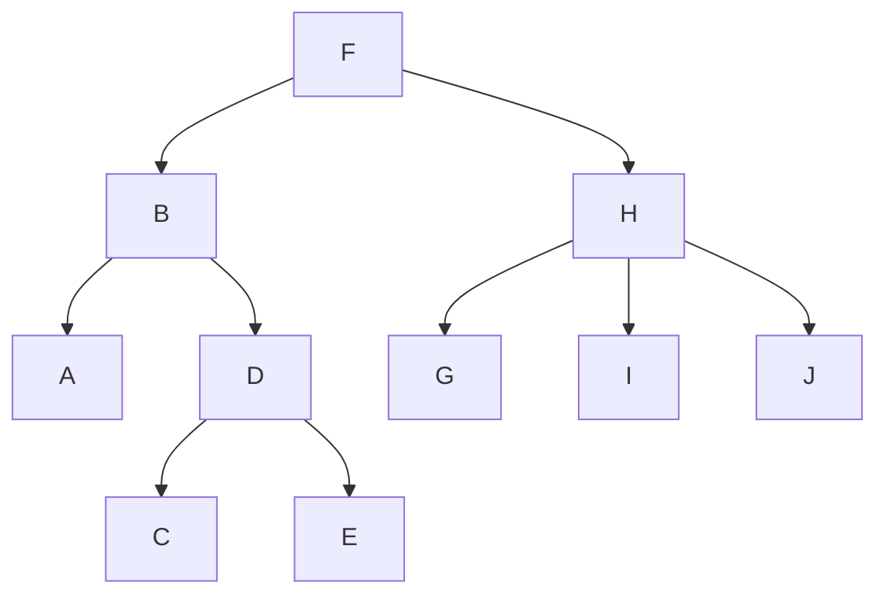

# iWink Tree

This component provides a [Tree](https://en.wikipedia.org/wiki/Tree_%28data_structure%29) that can be traversed and 
modified.

## Tree

The [`Tree`](src/TreeInterface.php) receives a root [`Node`](src/Node/NodeInterface.php) and contains methods to traverse the 
nodes contained in the root node: 

- `visitPostOrder` Traverses its children first (left to right) and then itself.
- `visitInOrder` Traverses its left children first, then itself, and then its right children.
- `visitPreOrder` Traverses itself first, and then it's children (left to right).
- `visitLevelOrder` Traverses per level.

## Visitors

The tree implements the [Visitor pattern](https://en.wikipedia.org/wiki/Visitor_pattern). A number of common visitors 
are included in this component:

- [`ValueVisitor`](src/Visitor/ValueVisitor.php) returns an array containing the value of each node.
- [`SerializerVisitor`](src/Visitor/SerializerVisitor.php) returns a serialized representation of the tree.

There are also 2 abstract visitors that provide a base implementation:

- [`Visitor`](src/Visitor/Visitor.php) implements empty `beforeVisiting()` and `afterVisiting()` methods.
- [`ArrayVisitor`](src/Visitor/ArrayVisitor.php) keeps a record of the result for every visit that can be read by calling `getResult(): iterable` after the visitor is done.

## Creating your own visitor

To create your own visitor you need to let it implement `VisitorInterface` or extend the abstract `Visitor` or
`ArrayVisitor` class.

Sometimes you need to perform some action before the visitor starts visiting or after it is done visiting. For
these situations you can use `beforeVisiting()` and `afterVisiting()` methods. E.g. The `ArrayVisitor` always resets the
internal array on `beforeVisiting()` to prevent result stacking on multiple calls.


## Example

### Building the tree

```php
<?php

use Iwink\Tree\Node\Node;
use Iwink\Tree\Tree;
use Iwink\Tree\Visitor\ValueVisitor;

$nodes = [];
foreach (range('A', 'I') as $value) {
	$nodes[$value] = new Node($value);
}

$nodes['D']->addChild($nodes['C'], $nodes['E']);
$nodes['H']->addChild($nodes['G'], $nodes['I'], $nodes['J']);
$nodes['B']->addChild($nodes['A'], $nodes['D']);
$nodes['F']->addChild($nodes['B'], $nodes['H']);

$tree = new Tree($nodes['F']);

```

A visual representation of this tree looks like this:



### Traversing the tree

Now we can traverse this tree and apply a visitor:

```php
// See code block above

$visitor = new ValueVisitor('strtolower'); // Convert the node's value to lowercase

$tree->visitPreOrder($visitor);
var_dump(iterator_to_array($visitor->getResult())); // ['f', 'b', 'a', 'd', 'c', 'e', 'h', 'g', 'i', 'j']

$tree->visitInOrder($visitor);
var_dump(iterator_to_array($visitor->getResult())); // ['a', 'b', 'c', 'd', 'e', 'f', 'g', 'h', 'i' 'j']

$tree->visitPostOrder($visitor);
var_dump(iterator_to_array($visitor->getResult())); // ['a', 'c', 'e', 'd', 'b', 'g', 'i', 'j', 'h', 'f']

$tree->visitLevelOrder($visitor);
var_dump(iterator_to_array($visitor->getResult())); // ['f', 'b', 'h', 'a', 'd', 'g', 'i', 'j', 'c', 'e']

```

### Serializing the tree

To persist the tree to a file or a database record, you can use `TreeInterface::serialize(?callable $converter = null)`. 
This serializes the tree to a format that preserves hierarchy and can be restored. If the node's values aren't scalar, 
you might want to pass a `$converter` to this method so those values are serializable as well. 

### Building the tree from a serialized format

If you have a serialized tree, you can restore it using 
`TreeInterface::fromSerialized(array $serialized, ?callable $converter = null, string $node_class = Node::class)`. It 
takes an optional `$converter` to restore the node's value if this isn't a scalar value. You can also pass your own 
implementation of a `$node_class` to create a tree that consists of different nodes. Just make sure your node class 
implements `NodeInterface`.  
